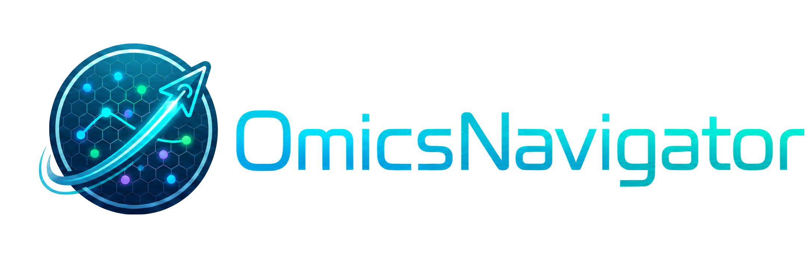

<p align="center">
  
</p>

# OmicsNavigator

<p align="center">
  
  
  
</p>

## Overview

Translating high-dimensional, spatially resolved molecular datasets into
testable biological findings remains a major bottleneck in spatial biology.
OmicsNavigator is an autonomous large language model-powered system for
end-to-end data exploration and hypothesis validation on spatial omics data. It
reasons over multi-modal inputs, including visual morphology and molecular
signatures, to annotate spatial structures and convert raw omics observations
into human-readable interpretations.

By transforming high-dimensional measurements into textual representations,
OmicsNavigator supports zero-shot semantic retrieval of tissue biomarkers and
the reconstruction of patient-level disease profiles. Its statistical validation
engine is governed by pre-registered, human-audited blueprints, making each
hypothesis test explicit and inspectable. The system has been evaluated across
datasets spanning diabetic kidney disease, kidney transplant rejection, and
COVID-19 pulmonary pathology.

This repository packages OmicsNavigator as a user-facing CLI with
offline demo artifacts, live-agent execution, and generated reports that expose
the planning, interpretation, retrieval, and validation stages.

The repository provides two execution modes:

| Mode | External services | Intended use |
| --- | --- | --- |
| `mock` | None | Cost-free functional demo using bundled reference artifacts |
| `real` | Gemini API key required | Live LangGraph execution on the configured dataset |

The recommended first run is `mock` mode. It exercises the CLI workflow, output
generation, and validation reporting without making LLM API calls.

## Quick Start

### 1. Install

```bash
git clone https://github.com/yyli-leo/OmicsNavigator.git
cd OmicsNavigator

python3.10 -m venv .venv
source .venv/bin/activate
python -m pip install --upgrade pip
python -m pip install -r requirements.txt
```

Typical install time on a normal desktop with internet access is approximately
5-10 minutes. Reinstalling into an environment where packages are already cached
or installed is faster.

### 2. Download Demo Data

[Download the s255 demonstration dataset from Google Drive](https://drive.google.com/file/d/1cLpwK0DFOA38tgHnR55qQzyZ2fkk9ewp/view?usp=drive_link).

After download, extract or copy the folder so the repository contains:

```text
data/s255/
├── README.md
├── s255_pivot_ROIs_registry.pkl
├── s255_pivot_ROIs_registry_dev.pkl
└── s255_c001_v001_r001_reg*/
```

The default config expects:

```yaml
session:
  sample_id: "s255"
  data_path: "./data/s255/"
  output_dir: "./outputs/s255_analysis/"
```

### 3. Run the Offline Demo

```bash
python -m cli.main
```

Inside the interactive prompt:

```text
/mode mock
/start
```

Press Enter once when the CLI asks to begin the pipeline. The mock agents then
advance automatically from one action to the next. Exit with:

```text
/exit
```

On the tested Ubuntu 20.04.3 LTS environment, the mock demo completed in about
40 seconds after the pipeline was started.

### 4. Optional: Run Real Mode

Real mode makes live LLM calls. This demo uses Gemini via LangChain Google
GenAI as the reference backend, but users can edit `cli/config.yaml` to select
the Gemini model that best matches their environment or budget. To use a
non-Gemini backend, replace the LangChain chat model adapter in
`src/workflows/langgraph_orchestrator.py` and update the API key environment
variable accordingly.

For the default Gemini backend, provide an API key before switching to real
mode:

```bash
cp .env.example .env
# Edit .env and set:
# GEMINI_API_KEY=your-gemini-api-key
```

Alternatively:

```bash
export GEMINI_API_KEY="your-gemini-api-key"
```

Then run:

```text
/mode real
/start
```

## System Requirements

### Tested Environment

| Component | Tested version |
| --- | --- |
| Operating system | Ubuntu 20.04.3 LTS |
| Python | 3.10.18 |
| Hardware | Standard CPU-only desktop or server; no GPU or non-standard hardware required |

OmicsNavigator has no operating-system-specific code paths or specialized
hardware requirements. It is expected to run on standard Linux or macOS systems
with Python 3.10 or newer. Windows has not been formally tested; use WSL2 or a
Linux environment if native dependency installation fails. Real mode requires
network access and a valid Gemini API key. Mock mode does not require an API
key.

### Python Dependencies

Install dependencies from `requirements.txt`. The table below records the
versions used in the tested local environment.

| Package | Tested version |
| --- | --- |
| `google-generativeai` | 0.8.6 |
| `langchain-google-genai` | 4.2.1 |
| `langchain-core` | 1.2.23 |
| `langgraph` | 1.1.3 |
| `rich` | 14.2.0 |
| `prompt-toolkit` | 3.0.52 |
| `numpy` | 2.2.6 |
| `pandas` | 2.3.2 |
| `scipy` | 1.15.3 |
| `statsmodels` | 0.14.6 |
| `faiss-cpu` | 1.13.2 |
| `Pillow` | 12.1.0 |
| `Jinja2` | 3.1.6 |
| `PyYAML` | 6.0.2 |
| `pydantic` | 2.11.7 |

The default installation uses `faiss-cpu` so the demo can run on standard
CPU-only hardware. For large-scale retrieval or paper-scale runs, users with an
NVIDIA GPU and compatible CUDA environment may replace `faiss-cpu` with a FAISS
GPU build for faster vector indexing and search. GPU acceleration is optional
and is not required for the bundled mock demo or the statistical validator.

## CLI Commands

| Command | Description |
| --- | --- |
| `/mode mock` | Use precomputed demo artifacts; no API calls |
| `/mode real` | Use live LangGraph agents; requires `GEMINI_API_KEY` |
| `/start` | Run the current execution mode |
| `/status` | Show config, data, metadata, hypothesis, and agent readiness |
| `/model` | Show default model, agent model overrides, and proxy setting |
| `/data` | Show dataset path and clinical phenotype mapping |
| `/hypothesis` | Show configured hypotheses |
| `/debug on` / `/debug off` | Toggle warning and traceback visibility |
| `/help` | List CLI commands |
| `/exit` or `/quit` | Exit the CLI |

## Demo Output

A successful mock run prints `Pipeline Execution Complete` and creates a new
session directory:

```text
outputs/s255_analysis/cli_complete_pipeline_<YYYYMMDD_HHMMSS>/
```

Expected files include:

```text
session_metadata.json
completion_summary.json
analysis_report.md
literature_query.md
literature_report.md
blueprint.json
VisualProfiler_checklist.md
OmicsProfiler_checklist.md
OmicsInterpreter_checklist.md
interpretation/
validation_report.md
validation_results.json
```

The completion summary should contain:

```json
{
  "execution_type": "mock",
  "status": "completed",
  "active_phases": [1, 2, 3],
  "sample_id": "s255",
  "results": {
    "conclusion": "FALSIFIED",
    "data_source": "full_registry",
    "source_snapshot": "reference_pipeline_snapshot"
  }
}
```

The bundled mock snapshot is based on an example `s255` pipeline run. Mock mode
is intended as an offline functional demonstration of the CLI, output format,
and validation reporting. It should not be interpreted as a new live LLM analysis
of the dataset.

## Running Real Mode

Real mode executes the live LangGraph workflow and may incur Gemini API costs.
It is the path to use when running OmicsNavigator on a configured dataset with
live agent calls.

```bash
python -m cli.main
```

Inside the prompt:

```text
/mode real
/start
```

By default, OmicsNavigator does not use an HTTP/HTTPS proxy. If your network
requires a local proxy for Gemini API access, edit `cli/config.yaml` before
running real mode:

```yaml
system:
  proxy:
    enabled: true
    scheme: "http"
    host: "127.0.0.1"
    port: 7897
```

Real mode uses bounded review-time settings to keep runtime and API cost
manageable:

- `LiteratureReviewer` generates a structured Deep Research query rather than
  launching a full external deep-research process.
- `VisualProfiler`, `OmicsProfiler`, and `OmicsInterpreter` process a small ROI
  subset to demonstrate the multimodal fusion interface.
- `Retriever` performs semantic search over the generated interpretation
  reports.
- `Validator` runs the statistical validation on the configured ROI registry.

These bounds affect runtime and cost, not the output file contracts or the
statistical validation interface demonstrated by the CLI.

## Running On Your Data

Edit `cli/config.yaml` before running real mode:

```yaml
session:
  sample_id: "s255"
  data_path: "./data/s255/"
  output_dir: "./outputs/s255_analysis/"
```

For a new dataset, set `sample_id`, `data_path`, and `output_dir` to your own
values. The data directory must contain registry files named with the same
sample ID:

```text
<sample_id>_pivot_ROIs_registry.pkl
<sample_id>_pivot_ROIs_registry_dev.pkl   # optional, used for constrained ROI profiling
```

Each region listed in the registry should have a matching subdirectory whose
CSV files share the region ID prefix:

```text
<region_id>/<region_id>.cell_data.csv
<region_id>/<region_id>.cell_types.csv
<region_id>/<region_id>.expression.csv
<region_id>/<region_id>.labels.csv
<region_id>/<region_id>_rendered.png
```

Required columns are documented in the downloaded `data/s255/README.md`. Update
`metadata.clinical_mapping` in `cli/config.yaml` so its keys match your region
IDs, then update the `hypotheses` section with the hypothesis to validate.

Mock mode remains tied to the precomputed `s255` demo artifacts and should not
be used as evidence that a new dataset has been analyzed.

## Reproducibility Scope

This repository is designed to make the review-time software behavior
inspectable: installation, demo execution, output generation, and validation
reporting can be checked locally. Reproducing all manuscript-scale quantitative
results requires the full production input set, external LLM access, and enough
API budget to re-run the large-scale literature and ROI interpretation stages.

For local verification after code changes:

```bash
python -m compileall -q cli src
```

## Project Layout

```text
OmicsNavigator/
├── assets/               # README images such as the project logo
├── cli/                  # Interactive CLI, config, mock pipeline
├── cli/mockdata/         # Precomputed artifacts and real-run mock snapshot
├── src/                  # Agents, LangGraph workflow, prompts, utilities
├── data/s255/            # Demonstration dataset after external download
├── outputs/              # Generated runtime outputs
├── requirements.txt      # Python dependencies
└── README.md
```
